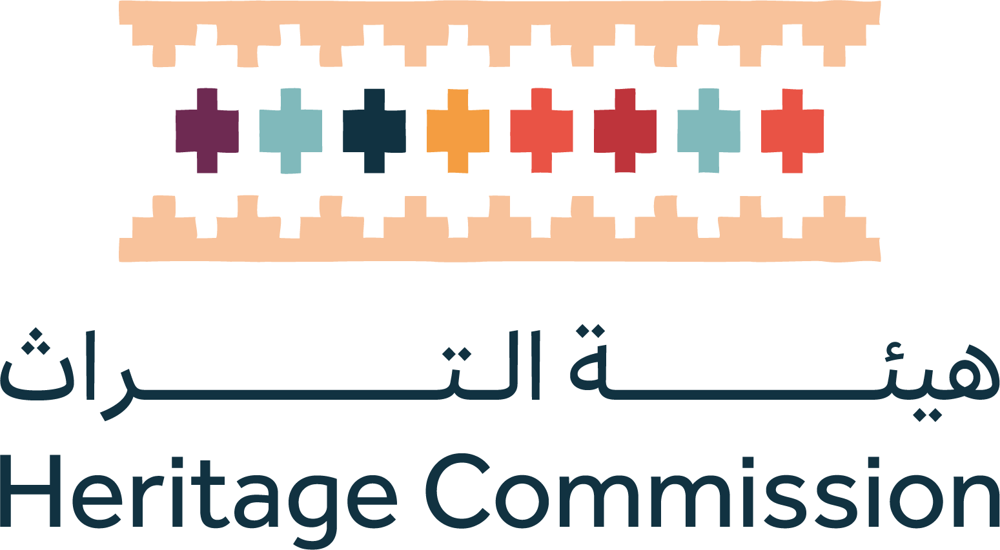
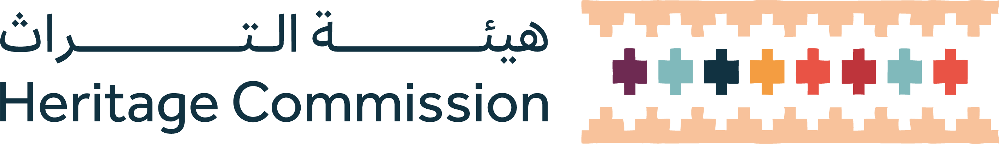

<html lang="en-US">
  <head>
    
    <meta charset="UTF-8">
    <meta http-equiv="X-UA-Compatible" content="IE=edge">
    <meta name="viewport" content="width=device-width, initial-scale=1">

<!-- Begin Jekyll SEO tag v2.8.0 -->
<title>Inventory-of-intangible-heritage</title>
<meta name="generator" content="Jekyll v3.10.0" />
<meta property="og:title" content="Inventory-of-intangible-heritage" />
<meta property="og:locale" content="en_US" />
<link rel="canonical" href="https://qzqan94-ui.github.io/Inventory-of-intangible-heritage/" />
<meta property="og:url" content="https://qzqan94-ui.github.io/Inventory-of-intangible-heritage/" />
<meta property="og:site_name" content="Inventory-of-intangible-heritage" />
<meta property="og:type" content="website" />
<meta name="twitter:card" content="summary" />
<meta property="twitter:title" content="Inventory-of-intangible-heritage" />

<!-- End Jekyll SEO tag -->

    <link rel="stylesheet" href="/Inventory-of-intangible-heritage/assets/css/style.css?v=adf6ab52688232fc57e25ffc8a9b5aafc74ec50f">
    <!-- start custom head snippets, customize with your own _includes/head-custom.html file -->

<!-- Setup Google Analytics -->

<!-- You can set your favicon here -->
<!-- link rel="shortcut icon" type="image/x-icon" href="/Inventory-of-intangible-heritage/favicon.ico" -->

<!-- end custom head snippets -->

  </head>
  <body>
    

      

<html lang="ar" dir="rtl">
<head>
<meta charset="utf-8" />
<meta name="viewport" content="width=device-width, initial-scale=1" />
<title>استمارة حصر عنصر التراث - تفاعلية</title>
<link rel="preconnect" href="https://cdnjs.cloudflare.com" crossorigin="" />

</head>
<body>

  

  <!-- الشعار فوق العنوان -->
  
  
  <!-- العنوان في المنتصف -->
  <h2 style="
      margin:0;
  ">
    استمارة حصر عناصر التراث غير المادي التفاعليه 
  </h2>

  <!-- WIZARD -->
  

    
سؤال 1 من 24

    <!-- Steps will be injected here -->
    

    

      

        <button id="prevBtn" class="btn-ghost" type="button" disabled="">السابق</button>
      

      

        <button id="nextBtn" type="button">التالي</button>
      

    

  

  <!-- Results (kept same structure as provided) -->
  

    

      <button id="backToWizard" class="btn-ghost" type="button">العودة للأسئلة</button>
      <button id="downloadPdf">تحميل PDF (5 ورقات)</button>
    

    

      <!-- We'll render the original tables here, populated from answers -->

     <table>
  <tr>
    <th class="section-title" colspan="0" style="
        border-top: 2px solid white;
        border-left: 2px solid white;
        border-right: 2px solid white;
        border-bottom: 2px solid black;
        background-color: white;
        padding: 10px;
        position: relative;
        text-align: center;
        height: 150px; /* فقط لضمان مساحة مناسبة للشعار */
    ">
      <!-- الشعار في المنتصف بالأعلى -->
      

      <!-- العنوان في المنتصف -->
      <h2 style="margin:0; text-align:center; width:100%; margin-top:80px;">
        استمارة حصر عناصر التراث غير المادي
      </h2>

    </th>
  </tr>

          <tr><th class="section-title" colspan="2">1 ـ تحديد عنصر التراث الثقافي غير المادي</th></tr>

          <tr><th>1.1-	اسم العنصر كما تستخدمه الجماعة المعنية (اسم العنصر في اللغة العامية)</th>
            <tr></tr>
              <td id="r_1_1"></td></tr>

          <tr><th>1.2-	عنوان مختصر ومفيد لعنصر التراث الثقافي غير المادي (يشير إلى مجال أو مجالات التراث الثقافي غير المادي الذي ينتمي إليه/إليها)</th>  <tr></tr>

              <td id="r_1_2"></td></tr>

          <tr><th>1.3 الجماعة (أو الجماعات) المعنية</th><tr></tr>
              <td id="r_1_3"></td></tr>

          <tr><th>1.4-	الموقع الطبيعي لعنصر التراث الثقافي غير المادي، ونطاق ممارسته ووتيرتها2 (الموقع الجغرافي للعنصر)</th><tr></tr>
              <td id="r_1_4"></td></tr>

          <tr><th>1.5 وصف مختصر لعنصر التراث الثقافي غير المادي</th><tr></tr>
              <td id="r_1_5"></td></tr>

          <tr><th>1.6	في اي مجال او مجلات من التراث الثقافي غير المادي يندرج العنصر؟",
</th><tr></tr>
              <td id="r_1_6"></td></tr>

          <tr><th>1.7	ما هي الوظائف والمعاني الاجتماعية والثقافية التي يقدمها العنصر لجماعته؟</th><tr></tr>
              <td id="r_1_7"></td></tr>
      </table>

      <table>
        <tr><th class="section-title" colspan="2">2 ـ خصائص العنصر</th></tr>

        <tr><th>1.2-	الممارسون/المؤدون المعنيون بشكل مباشر بأداء عنصر التراث الثقافي غير المادي وممارسته (الاسم/العمر/الجنس/عنوان التواصل)</th><tr></tr>
            <td id="r_2_1"></td></tr>

        <tr><th>2.2-	مشاركون آخرون معنيون بالعنصر ولكن بطريقة لا ترتقي إلى ممارسته وأدائة وإنما يساهمون في إدامة ممارسته أو يسهلون عملية ممارسته ونقلها (مثل الذين يُحَضِّرون مكان أو مسرح الأداء أو الأزياء أو الذين يقومون بمهام التدريب أو الإشراف أو الرعاية)'</th><tr></tr>
            <td id="r_2_2"></td></tr>

        <tr><th>2.3-	اللغة/اللغات المستخدمة في أداء أو ممارسة العنصر</th><tr></tr>
            <td id="r_2_3"></td></tr>

        <tr><th>2.4-	العناصر المادية المرتبطة بممارسة العنصر ونقله نحو الأدوات/المعدات، الأزياء، الأماكن، والأدوات الطقوسية (إن وجدت)'</th><tr></tr>
            <td id="r_2_4"></td></tr>

        <tr><th>2.5-	عناصر غير مادية أخرى (إن وجدت) مرتبطة بممارسة العنصر المعني ونقله</th><tr></tr>
            <td id="r_2_5"></td></tr>

        <tr><th>2.6-	الممارسات العرفية (إن وجدت) التي تحكم الانتفاع بالعنصر أو أي جانب من جوانبه</th><tr></tr>
            <td id="r_2_6"></td></tr>

        <tr><th>2.7	طرائق النقل إلى الأعضاء الآخرين في الجماعة او كيف يتم نقل المعارف والمهارات الخاصة بالعنصر في العصر الحالي؟</th><tr></tr>
            <td id="r_2_7"></td></tr>

        <tr><th>2.8	المنظمات المعنية (منظمات المجتمعات المحلية والمنظمات غير الحكومية أو غيرها، إن وجدت)'</th><tr></tr>
            <td id="r_2_8"></td></tr>
      </table>

      <table>
          <tr><th class="section-title" colspan="2">3 ـ حالة العنصر: قدرته على البقاء والاستدامة</th></tr>
          <tr><th>'3-1 الجهود السابقة والحالية لصون العنصر : يرجى اختيار واحد أو اكثر من الاختيارات الآتيه لتحدسد إجراءات الصون التي تم اتخاذها سابقاَ ويتم اتخاذها حالياَمن قبل الجماعات أو الافراد المعنية بالعنصر</th><tr></tr>
              <td id="r_3_1"></td></tr>

          <tr><th>3.2 الجهة (الجهات) المختصة القائمة على عملية الصون</th><tr></tr>
              <td id="r_3_2"></td></tr>

          <tr><th>3.3 حالة العنصر في الوقت الحالي</th><tr></tr>
              <td id="r_3_3"></td></tr>

          <tr><th>3.4 التهديدات (إن وجدت) التي تحدد بالأداء المتواصل للعنصر في إطارالجماعة/الجماعات المعنية</th><tr></tr>
              <td id="r_3_4"></td></tr>

              <tr><th>3.5 التهديدات (إن وجدت) التي تحدق بانتقال العنصر في إطار الجماعة/الجماعات المعنية</th><tr></tr>
              <td id="r_3_5"></td></tr>
              
              <tr><th>3.6 التهديدات التي تحدق باستدامة الانتفاع بالعناصر المادية والموارد (إن وجدت) المرتبطة بعنصر التراث الثقافي غير المادي.</th><tr></tr>
              <td id="r_3_6"></td></tr>

          <tr><th>3.7 قابلية استدامة عناصر التراث غير المادي الأخرى (إن وجت) المرتبطة بالعنصر</th><tr></tr>
              <td id="r_3_7"></td></tr>

          <tr><th>3.8 تدابير الصون المتخذة في المكان (إن وجدت) أو غيرها لمعالجة أي من هذه التهديدات، وتشجيع ممارسة العنصر ونقله في المستقبل </th><tr></tr>
              <td id="r_3_8"></td></tr>
      </table>

      <table>
          <tr><th class="section-title" colspan="2">4 ـ القيود والأذونات على البيانات</th></tr>

          <tr><th>4.1 موافقة الجماعة/الجماعات المعنية على توفير المعلومات ومشاركتهم في جمعها</th><tr></tr>
              <td id="r_4_1"></td></tr>

          <tr><th>4.2 القيود (إن وجدت) المفروضة على مسالة الانتفاع بالبيانات واستعمالها</th><tr></tr>
              <td id="r_4_2"></td></tr>

          <tr><th>4.3 تواريخ جمع المعلومات وأمكنتها</th><tr></tr>
              <td id="r_4_3"></td></tr>

          <tr><th>4.4 الأشخاص المخبرون (الرواة/المزودون بالمعلومات) (أسماؤهم، ومكانتهم، وانتماؤهم)</th><tr></tr>
              <td id="r_4_4"></td></tr>
      </table>

      <table>
          <tr><th class="section-title" colspan="2">5 ـ المراجع</th></tr>
          <tr><th>5.1 الأدبيات: كتب، مقالات... وغيرها</th><tr></tr>
              <td id="r_5_1"></td></tr>
          <tr><th>5.2 المواد السمعية والبصرية، تسجيلات إلخ في المحفوظات والمتاحف والمجموعات الخاصة (إن وجدت)</th><tr></tr>
              <td id="r_5_2"></td></tr>

          <tr><th>5.3 مواد وثائقية، وأدوات في دور المحفوظات والمتاحف والمجموعات الخاصة (إن وجدت)</th><tr></tr>
              <td id="r_5_3"></td></tr>
      </table>

    

    <!-- PDF pages container (hidden in UI but used when generating PDF) -->
    

  

<!-- include html2pdf from CDN -->

</body>
</html>

      
    

    
    
  </body>
</html>
